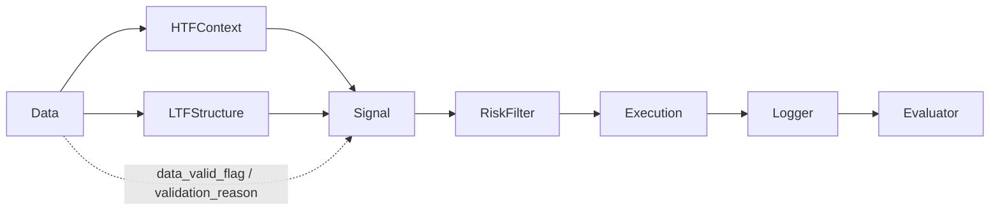

# 01 System Flow

## 概要
Trading EA の上位モジュール間フローを示す。  
単方向データフローを基本とし、`Data` の検証結果は後続進行可否に影響する。

## 補足
- `docs/01_overview.md` には理解順として直列フローが記載される。
- `docs/10_interface_contract.md` の契約上は、`Data` から `HTFContext` と `LTFStructure` に受け渡した結果を `Signal` が統合する。

## 参照元
- `docs/01_overview.md`
- `docs/03_architecture.md`
- `docs/10_interface_contract.md`
