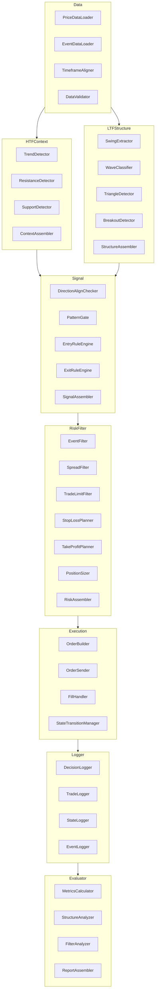

# 02 Module Map

## 概要
上位モジュールと下位部品候補の分解を示す。  
上位モジュールは「流れ」を、下位部品は「交換可能な責務」を表す。

## 補足
- 図は「候補構成」を示す。実装順・実装粒度は `ops/CURRENT_TASKS.md` を優先する。
- Experiments は本体系と分離運用するため本図から除外した。

## 参照元
- `docs/03_architecture.md`
- `docs/04_module_spec.md`
- `docs/07_test_plan.md`
- `ops/CURRENT_TASKS.md`
