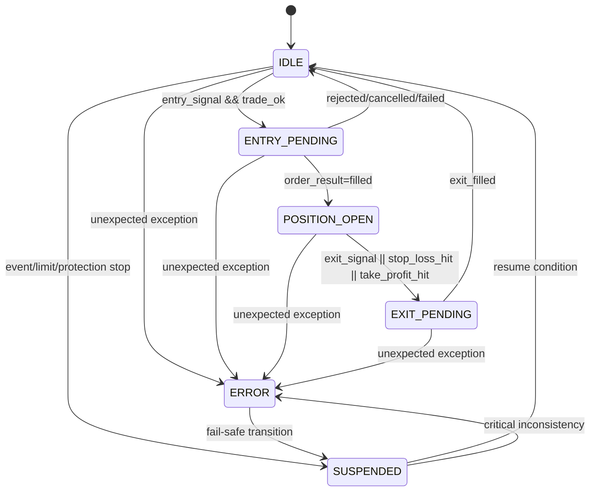

# 03 State Transitions

## 概要
`position_state` の基本遷移を示す。  
状態遷移は `StateTransitionManager` 経由で扱う前提とする。

## 補足
- `ANY -> ERROR` を個別遷移として明示した。
- 初期段階では `ERROR` 後に安全側として `SUSPENDED` へ落とす運用を許容する。

## 参照元
- `docs/06_state_spec.md`
- `docs/10_interface_contract.md`
- `docs/04_module_spec.md`（Execution / StateTransitionManager）
