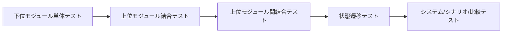

# 05 Test Map

## 概要
モジュール、契約、主要変数、テスト観点の対応を整理したマップ。  
詳細ケースは `docs/07_test_plan.md` を正本とする。

## 対応表（初期版）
| モジュール | 境界契約の要点 | 主要変数 | 主なテスト観点 |
|---|---|---|---|
| Data | 検証NGは失敗結果、契約違反は例外 | `timestamp`, `spread`, `volume`, `data_valid_flag`, `validation_reason`, `event_flag` | timezone正規化、欠損検出、H1/H4、CSV/parquet/pkl役割 |
| HTFContext | 定義済み分類・理由追跡 | `htf_trend_dir`, `htf_bias`, `htf_context_reason` | 方向分類、支持抵抗判定、理由保持 |
| LTFStructure | main は `third_wave_break`、`triangle_break` は experiments、競合は安全側見送り | `structure_type`, `structure_direction`, `breakout_flag`, `pattern_reason` | `third_wave_break` main、`triangle_break` experiments、競合時 `none / neutral / false` |
| Signal | 入出力整合と分類整合 | `entry_signal`, `exit_signal`, `signal_type`, `signal_reason` | 統合判定、矛盾検知、理由保持 |
| RiskFilter | `trade_ok` とパラメータ整合 | `trade_ok`, `lot`, `stop_loss`, `take_profit`, `filter_reason` | 停止条件、spread/event/回数制限、値域妥当性 |
| Execution | 状態遷移と実行結果 | `order_result`, `position_state`, `execution_reason` | 発注/約定/失敗、遷移制約、異常時安全側遷移 |
| Logger | ログ責務分離 | `decision_logs`, `trade_logs`, `state_logs`, `event_logs` | ログ欠損防止、理由追跡、状態遷移記録 |
| Evaluator | 再集計可能性と比較軸 | `trade_count`, `win_rate`, `profit_factor`, `max_drawdown`, `filter_hit_stats` | 指標計算、構造別・signal_type別・filter_reason別分析 |

## current policy 補足
- 初期 main の LTFStructure テスト対象は `third_wave_break`
- `triangle_break` は `tests/experiments/` 側で扱う
- 競合ケースは `structure_type = none`、`structure_direction = neutral`、`structure_candidate = false` を確認する

## 参照元
- `docs/07_test_plan.md`
- `docs/10_interface_contract.md`
- `docs/05_variable_spec.md`
- `docs/06_state_spec.md`
