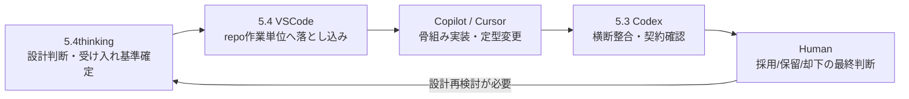

# 06 AI Workflow

## 概要
`ops/AGENT_WORKFLOW.md` に基づく役割分担と handoff の流れ。  
フェーズ単位で進め、細かい ping-pong を避ける。

## handoff 要点（要約）
- 5.4thinking -> 5.4: 目的、受け入れ基準、例外境界、優先順位が明文化されていること
- 5.4 -> Copilot/Cursor: 対象ファイル、命名、I/O、非対応範囲、確認観点が実装粒度で渡されること
- Copilot/Cursor -> 5.3 Codex: フェーズ単位のまとまりとして差分が揃っていること
- 5.3 Codex -> Human: docs/実装/テスト観点の整合が確認済み、または未解決点が記録済みであること

## 現在タスクとの接続（初期版）
- `ops/CURRENT_TASKS.md` の最優先は Data 実装準備と Data 契約整合確認。
- Data 後は Signal、Logger/Evaluator の順に同じ handoff 構造で進行する。

## 参照元
- `ops/AGENT_WORKFLOW.md`
- `ops/CURRENT_TASKS.md`
