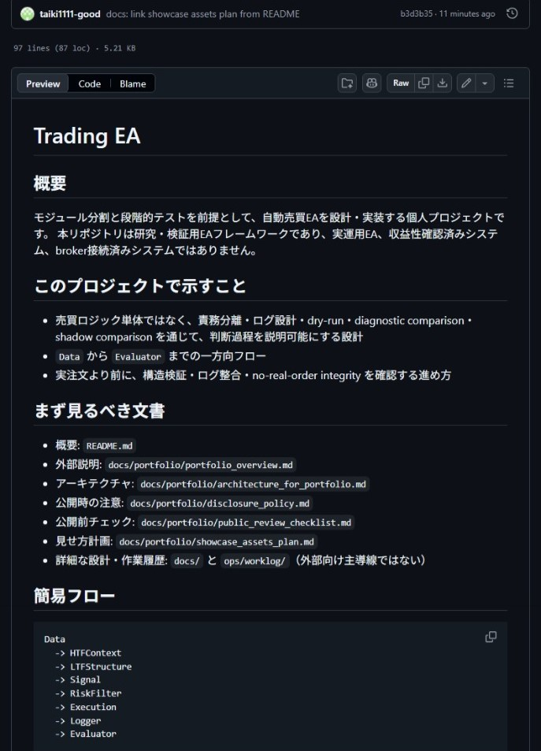
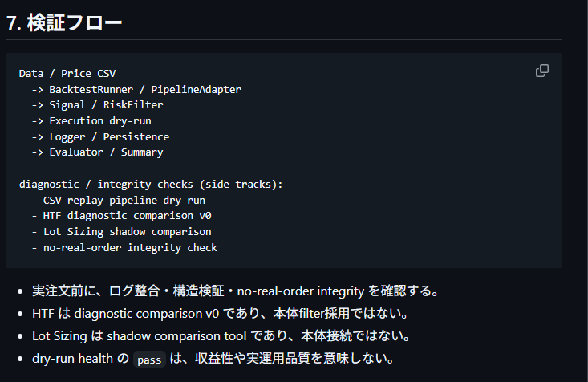

# Showcase Assets Plan

本書は、`trading-ea` を外部向けポートフォリオとして見せる際に、どの成果物をスクリーンショット・図解・短い説明として提示するかを整理するための計画である。

本書は外部説明用の補助文書であり、Source of Truth ではない。正式な現状・契約・実装境界は `ops/CURRENT_TASKS.md`、`docs/03_architecture.md`、`docs/04_module_spec.md`、`docs/05_variable_spec.md`、`docs/10_interface_contract.md`、`docs/17_backtest_design.md` を優先する。

## 1. 見せ方の基本方針

このプロジェクトは、設計・検証・説明可能性を重視した研究/検証用EAフレームワークとして見せる。実際の取引システムとの接続や注文送信機能は実装していない。

外部説明では、以下を中心に見せる。

- モジュール分割と責務分離
- 時系列処理と future leak 防止
- dry-run（実注文を行わない検証実行）によるログ整合確認
- no-real-order integrity（実注文が発生していないことの整合確認）
- diagnostic comparison（採用前の診断比較）による比較設計
- shadow comparison（本体挙動に影響させない比較）による本体接続前の比較
- 判断理由と状態遷移を追跡できるログ設計

## 2. 推奨するスクリーンショット / 図解候補

### 2.1 README 冒頭

目的:
- 初見読者に、プロジェクトの位置づけと主導線を伝える。

見せる箇所:
- `このプロジェクトで示すこと`
- `まず見るべき文書`
- `簡易フロー`

安全なキャプション例:
> 責務分離・ログ設計・dry-run を通じて判断過程を説明可能にする研究・検証用EAフレームワークとして整理している。

### 2.2 アーキテクチャ図

目的:
- Data から Evaluator までの一方向フローを示す。

見せる箇所:
- `README.md` の簡易フロー
- `docs/portfolio/architecture_for_portfolio.md` の全体フロー

安全なキャプション例:
> 売買判断を一つの巨大な条件式にせず、Data、Signal、RiskFilter、Execution、Logger、Evaluator へ責務分離している。

### 2.3 検証フロー図

目的:
- 何をどう検証しているかを示す。

見せる箇所:
- `docs/portfolio/portfolio_overview.md` の `検証フロー`

安全なキャプション例:
> BacktestRunner / PipelineAdapter / CSV replay dry-run を使って、構造検証、ログ整合、no-real-order integrity を確認する。

注意:
- `dry_run_health_status=pass` を収益性や実運用品質として説明しない。

### 2.4 抽象ログ例

目的:
- 判断理由・状態遷移・イベントをログから追跡できる設計を示す。

見せる箇所:
- `docs/portfolio/architecture_for_portfolio.md` の `抽象ログ例`

安全なキャプション例:
> 実データや成績値ではなく、判断理由と状態遷移を後から検証できるようにするためのログ設計例である。

注意:
- 実際の PnL、win_rate、total_pnl は載せない。
- 実績値や収益性を示す図として扱わない。

### 2.5 Disclosure Policy / Public Review Checklist

目的:
- 実装済み・検証済み・未実装を分けて説明していることを示す。

見せる箇所:
- `docs/portfolio/disclosure_policy.md`
- `docs/portfolio/public_review_checklist.md`

安全なキャプション例:
> 公開時に、到達点と未実装範囲を分けて説明できるように整理している。

## 3. 撮影対象チェックリスト

外部向けにスクリーンショットや図解を用意する場合は、以下を優先する。

### 3.1 優先1: README 冒頭

- [ ] `このプロジェクトで示すこと` が見える範囲を撮る。
- [ ] `まず見るべき文書` が見える範囲を撮る。
- [ ] `簡易フロー` が見える範囲を撮る。
- [ ] キャプションでは、研究・検証用EAフレームワークであり、実際の取引システムとは接続していないことを明記する。

避けること:
- [ ] 運用準備完了や収益性を示す画面として扱わない。
- [ ] `ops/worklog/` を最初の説明導線として見せない。

### 3.2 優先2: 検証フロー

- [ ] `docs/portfolio/portfolio_overview.md` の `検証フロー` を撮る。
- [ ] Data / Price CSV から Evaluator / Summary までの流れが見えるようにする。
- [ ] diagnostic / integrity checks の side tracks が見えるようにする。
- [ ] キャプションでは、構造検証、ログ整合、no-real-order integrity の確認であることを明記する。

避けること:
- [ ] `dry_run_health_status=pass` を収益性や実運用品質として説明しない。
- [ ] 個別run結果やPnL数値をセットで見せない。

### 3.3 優先3: アーキテクチャ / 抽象ログ例

- [ ] `docs/portfolio/architecture_for_portfolio.md` の全体フローを撮る。
- [ ] 同文書の `抽象ログ例` を撮る。
- [ ] キャプションでは、判断理由・状態遷移を後から追跡できる設計であることを説明する。
- [ ] 抽象ログ例は実データ・実績値ではないと明記する。

避けること:
- [ ] PnL、win_rate、total_pnl を見せない。
- [ ] 注文送信ログや取引システム接続ログのように見せない。

### 3.4 優先4: Disclosure Policy / Public Review Checklist

- [ ] `docs/portfolio/disclosure_policy.md` の表現方針・推奨表現を撮る。
- [ ] `docs/portfolio/public_review_checklist.md` の未実装事項チェックを撮る。
- [ ] キャプションでは、到達点と未実装範囲を分ける公開方針であることを説明する。

避けること:
- [ ] 注意表現のリストを、実装済み項目の一覧のように見せない。

## 4. 画像保存・命名ルール

スクリーンショットや図解を追加する場合は、以下の場所に置く。

```text
docs/portfolio/assets/
```

推奨ファイル名:

```text
01_readme_entrypoint.png
02_validation_flow.png
03_architecture_flow.png
04_abstract_log_example.png
05_public_review_checklist.png
```

運用ルール:
- 画像は外部説明用の補助資料として扱う。
- 画像だけで実装済み・未実装を判断できるようにしようとせず、必ず本文へのリンクやキャプションと併用する。
- ローカルパス、個人情報、実データ、API key / token / secret が映り込まないようにする。
- PnL、win_rate、total_pnl などの成績数値を中心にした画像は現時点では作らない。
- 注文送信画面や取引システム接続画面のように見える画像は扱わない。

README や portfolio docs に画像を貼る場合は、以下のような相対パスを使う。

```markdown

```

ただし、画像追加は必須ではない。まずは README と `docs/portfolio/*` の文章導線を主導線とする。

## 5. 現在追加済みの画像

### README entrypoint


研究・検証用EAフレームワークとして、責務分離・ログ設計・dry-runを通じて判断過程を説明可能にする方針を整理したREADME冒頭。

### Validation flow


BacktestRunner / PipelineAdapter / CSV replay dry-runを使って、構造検証・ログ整合・no-real-order integrityを確認する検証フロー。

補足:
- これらの画像は補助資料であり、本文の説明と併用して扱う。
- PnL、win_rate、total_pnl などの成績数値を示すものではない。
- 実際の取引システムとの接続や注文送信機能を示すものではない。

## 6. 現時点では避けるもの

以下は、誤読リスクが高いため外部説明の中心にしない。

- PnL グラフ
- win_rate / total_pnl / average_pnl などの成績数値
- 実データの詳細な期間・条件に依存する比較結果
- worklog 内の個別 run 結果
- 取引システム接続や注文送信に見える画面
- 運用準備完了を示すような表現

## 7. 推奨する公開順

外部説明では、次の順番で見せる。

1. README 冒頭
2. `docs/portfolio/portfolio_overview.md`
3. `docs/portfolio/architecture_for_portfolio.md`
4. `docs/portfolio/interview_pitch.md`
5. `docs/portfolio/disclosure_policy.md`
6. `docs/portfolio/public_review_checklist.md`

必要に応じて、詳細設計として `docs/09_presentation_notes.md`、`docs/10_interface_contract.md`、`docs/17_backtest_design.md` を参照する。

`ops/worklog/` は詳細な作業履歴・設計判断履歴であり、最初の説明導線にはしない。

## 8. 今後追加する場合の候補

将来、さらに見せ方を強化する場合は、以下を検討する。

- README 用の小さな architecture diagram
- portfolio 用の validation flow image
- abstract log example の画像化
- テスト実行結果の要約スクリーンショット
- ただし、PnL や収益性を示す図は現段階では扱わない。
